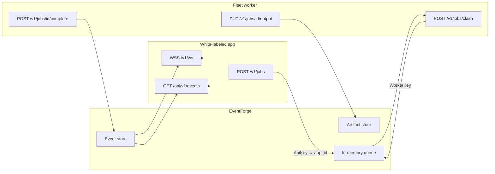

# EventForge Queue Integration

Integration guide for **white-labeled apps** connecting to the EventForge job queue and event bus.

EventForge is a single service that combines:

- **HTTP job queue** — apps enqueue work; GPU/Ollama workers claim and execute it
- **WebSocket event bus** — apps subscribe to lifecycle and completion events in real time
- **HTTP event replay** — fallback when WebSocket is unavailable

Each white-labeled app gets its own **API key** mapped to an **`app_id`**. All events and queue stats are scoped to that `app_id`. Workers use a separate **worker key**.

---

## Architecture



**Typical flow**

1. App enqueues a job (`POST /v1/jobs`). EventForge assigns `app_id` from the API key.
2. Worker claims a matching job (`POST /v1/jobs/claim`). EventForge emits `forge.job.started`.
3. Worker uploads output to EventForge (`PUT /v1/jobs/{id}/output`), not directly to object storage.
4. Worker completes or fails the job. EventForge persists the event and pushes it over WebSocket.
5. App receives the completion (live WS or HTTP replay), resolves `job_id` in its local ledger, and fetches artifacts using keys/URLs from the manifest.

---

## Prerequisites

| Item | Description |
|------|-------------|
| **Base URL** | HTTPS origin of EventForge, e.g. `https://eventforge.example.com` |
| **WebSocket URL** | `{base}` with scheme `wss://` (or `ws://` locally) + path `/v1/ws` |
| **App API key** | Issued by platform ops; maps to your `app_id` on the EventForge side |
| **Worker key** | Separate credential for fleet workers (not embedded in end-user apps) |

Health checks (no auth):

- `GET /health` — queue loaded, job counts
- `GET /healthws` — WebSocket layer ready

Apps should verify both endpoints before enqueueing or opening a WebSocket (see reference: `EventForgeClient.IsHealthyAsync`).

---

## Authentication

All authenticated endpoints accept the token in either form:

```http
Authorization: Bearer YOUR_TOKEN
```

or

```http
GET /v1/ws?token=YOUR_TOKEN
```

| Key type | Used by | Endpoints |
|----------|---------|-----------|
| **App API key** | White-labeled apps | `POST /v1/jobs`, `GET /api/v1/events`, `WSS /v1/ws`, `GET /v1/queue/stats` |
| **Worker key** | Fleet workers | `POST /v1/jobs/claim`, `PUT …/output`, `POST …/complete`, `POST …/fail`, `POST …/release`, monitoring endpoints |

The API key **value** is the secret; EventForge maps it to an **`app_id`** string (your tenant identity). You do not send `app_id` on enqueue — it is inferred from the key.

**Multi-tenant shared fleet:** When several apps share one EventForge deployment, each app’s events include `manifest.tenant_id` equal to that app’s `app_id`. Filter completions against your configured tenant id and ignore events for other tenants.

---

## Configuration reference

### EventForge server (`EventForge:*`)

Ops configures key → app_id mappings:

```jsonc
{
  "EventForge": {
    "ListenUrl": "http://localhost:8090",
    "LeaseSeconds": 900,
    "PingIntervalSeconds": 30,
    "ApiKeys": {
      "your-secret-api-key": "your-app-id"
    },
    "WorkerKeys": {
      "your-secret-worker-key": "worker-pool-name"
    },
    "Artifacts": {
      "Enabled": true,
      "Bucket": "your-artifacts-bucket",
      "Prefix": "event-forge/jobs",
      "Region": "us-east-2"
    }
  }
}
```

### White-labeled app client

```jsonc
{
  "EventForge": {
    "BaseUrl": "https://eventforge.example.com",
    "WsUrl": "wss://eventforge.example.com/v1/ws",
    "ApiKey": "your-secret-api-key",
    "PollIntervalSeconds": 60,
    "PingIntervalSeconds": 30,
    "WsIdleTimeoutSeconds": 120
  },
  "Fleet": {
    "GenQueue": {
      "Mode": "eventforge",
      "TenantId": "your-app-id"
    }
  }
}
```

Environment variable equivalents: `EVENT_FORGE_URL`, `EVENT_FORGE_WS`, `EVENT_FORGE_API_KEY`.

### Job routing fields

| Field | Required | Description |
|-------|----------|-------------|
| `capability` | Yes | Worker pool identifier, e.g. `flux-klein`, `ollama-chat`, `caption`. Workers claim by capability. |
| `tier` | No (default `bulk`) | Priority lane: `admin`, `vip`, `normal`, or `bulk`. |
| `kind` | No (default `image`) | `image` or `text_stream`. |
| `job_id` | No | Client-supplied id (UUID recommended). Auto-generated if omitted. |
| `payload` | Yes | Opaque JSON consumed by the worker. |

`tenant_id` in completion manifests equals your `app_id`. Set `Fleet:GenQueue:TenantId` (or equivalent) in your app config to match for filtering.

---

## App integrators

### Enqueue a job

```http
POST /v1/jobs
Authorization: Bearer YOUR_APP_API_KEY
Content-Type: application/json
```

**Request body**

```json
{
  "job_id": "550e8400-e29b-41d4-a716-446655440000",
  "capability": "flux-klein",
  "tier": "normal",
  "kind": "image",
  "payload": {
    "type": "gen_job",
    "job_uuid": "550e8400-e29b-41d4-a716-446655440000",
    "tenant_id": "your-app-id",
    "model": "flux-klein",
    "resolution": "1024x1024",
    "payload": {
      "prompt": "a scenic mountain landscape"
    }
  }
}
```

**Response `200`**

```json
{
  "job_id": "550e8400-e29b-41d4-a716-446655440000",
  "status": "queued",
  "app_id": "your-app-id",
  "kind": "image"
}
```

The `payload` object is opaque to EventForge. Structure it for your workers. LoboForge wraps generation jobs in a `gen_job` envelope (see `GenSqsJobQueue.BuildPayloadBytesAsync`).

Store `job_id` in your local job ledger before or immediately after enqueue so completions can be correlated.

### Event types

| Event type | When emitted | App action |
|------------|--------------|------------|
| `forge.job.started` | Worker claimed the job | Optional: mark job *processing*, show worker hostname |
| `forge.job.completed` | Worker finished successfully | Mark complete; read manifest `outputs` or `text` |
| `forge.job.failed` | Worker reported failure | Mark failed; read `error` |
| `forge.job.timeout` | Lease expired; job requeued | Treat as retryable; job returns to queue |
| `forge.job.released` | Worker voluntarily released lease | Treat as retryable; job returns to queue |
| `forge.stream.token` | Text stream delta (`kind=text_stream`) | Append to live UI |
| `forge.stream.done` | Text stream finished | Finalize streamed text |

Clients **must not** publish these event types over WebSocket. EventForge rejects client publishes with `publish_forbidden`.

### WebSocket: connect, subscribe, replay

1. Connect to `wss://{host}/v1/ws?token={API_KEY}` (or send `Authorization: Bearer` if your client supports it on WS upgrade).
2. Send **`hello`** — server responds with `{ "type": "hello", "ok": true, "app_id": "…", "protocol": 1 }`.
3. Send **`subscribe`** with the event types you need.
4. Send **`replay`** with a UTC ISO-8601 `since` timestamp to backfill missed events after reconnect.
5. Respond to server **`ping`** with **`pong`** (or rely on your client’s keepalive).

**Subscribe**

```json
{
  "type": "subscribe",
  "events": [
    "forge.job.started",
    "forge.job.completed",
    "forge.job.failed",
    "forge.job.timeout",
    "forge.job.released",
    "forge.stream.token",
    "forge.stream.done"
  ]
}
```

Server responds:

```json
{
  "type": "subscribed",
  "events": ["forge.job.completed", "..."]
}
```

**Replay**

```json
{
  "type": "replay",
  "since": "2026-07-04T12:00:00.0000000Z"
}
```

Server responds with a batch:

```json
{
  "type": "replay.batch",
  "count": 2,
  "events": [
    {
      "type": "forge.job.completed",
      "event_id": "…",
      "app_id": "your-app-id",
      "job_id": "550e8400-e29b-41d4-a716-446655440000",
      "manifest": { "…": "…" },
      "completed_at": "2026-07-04T12:05:00.0000000Z"
    }
  ]
}
```

Advance your stored `since` cursor to the latest `completed_at` (or `started_at`) you process so the next replay or poll is incremental.

### HTTP fallback: poll events

When WebSocket is down, poll periodically:

```http
GET /api/v1/events?since=2026-07-04T12:00:00.0000000Z
Authorization: Bearer YOUR_APP_API_KEY
```

**Response `200`**

```json
{
  "count": 1,
  "events": [
    {
      "type": "forge.job.completed",
      "eventId": "…",
      "appId": "your-app-id",
      "jobId": "550e8400-e29b-41d4-a716-446655440000",
      "manifest": { "…": "…" },
      "completedAt": "2026-07-04T12:05:00.0000000Z"
    }
  ]
}
```

Recommended pattern: **WebSocket primary + HTTP poll backstop** on a 30–60 s interval. Deduplicate by `{event_id}:{job_id}`.

### Completion handling

#### Image jobs (`kind: image`)

Completion manifest shape:

```json
{
  "job_id": "550e8400-e29b-41d4-a716-446655440000",
  "status": "completed",
  "tenant_id": "your-app-id",
  "capability": "flux-klein",
  "tier": "normal",
  "kind": "image",
  "outputs": [
    {
      "key": "s3://artifacts-bucket/event-forge/jobs/550e8400…/output.png",
      "url": "s3://artifacts-bucket/event-forge/jobs/550e8400…/output.png",
      "content_type": "image/png"
    }
  ],
  "completed_at": "2026-07-04T12:05:00.0000000Z",
  "worker_id": "wrath",
  "hostname": "gpu-node-01"
}
```

Use `outputs[].key` (or `url`) to fetch the artifact from your configured bucket/prefix. EventForge wrote the object during the worker’s `PUT /output` call.

#### Text stream jobs (`kind: text_stream`)

```json
{
  "job_id": "…",
  "status": "completed",
  "tenant_id": "your-app-id",
  "kind": "text_stream",
  "text": "Full assembled reply text",
  "completed_at": "…",
  "worker_id": "…",
  "hostname": "…"
}
```

Live tokens arrive as `forge.stream.token` events with `{ "delta": "word " }` before `forge.stream.done`.

#### Failure manifest

```json
{
  "job_id": "…",
  "status": "failed",
  "tenant_id": "your-app-id",
  "error": "CUDA OOM",
  "completed_at": "…",
  "requeued": false
}
```

#### Tenant filtering (multi-tenant fleet)

When multiple apps share one EventForge deployment:

```csharp
var tenantId = manifest.GetProperty("tenant_id").GetString();
if (!string.Equals(tenantId, ownTenantId, StringComparison.OrdinalIgnoreCase))
    return; // not ours
```

Events without `tenant_id` may be accepted on legacy paths; new integrations should always set and check it.

### Tier and priority guidance

| Tier | Typical use | Notes |
|------|-------------|-------|
| `admin` | Operator / internal tools | Highest priority |
| `vip` | Paid tier, priority jump | Above normal user traffic |
| `normal` | Standard interactive jobs | Default for roleplay/chat |
| `bulk` | Batch generation, captions | Default when tier omitted; drained last |

Workers send their supported **capabilities**; EventForge picks the highest-priority queued job matching any capability. Priority order: tier `admin` → `vip` → `normal` → `bulk`, then `queue_priority` (if set on the job), then FIFO by enqueue time.

Map your app’s internal priority to tier strings consistently. LoboForge reference mapping (`QueuePriority.TopicTierForJob`):

- Admin → `admin`
- VIP (including priority jump) → `vip`
- Normal → `normal`
- Bulk → `bulk`

### Monitoring (queue dashboard apps)

Separate monitoring apps may use either an app API key or a worker key.

**Queue depth**

```http
GET /v1/queue/stats
Authorization: Bearer YOUR_TOKEN
```

```json
{
  "jobs_total": 42,
  "jobs_queued": 10,
  "jobs_in_progress": 3,
  "jobs_completed": 28,
  "jobs_failed": 1,
  "by_capability": [
    { "capability": "flux-klein", "queued": 8, "in_progress": 2 }
  ]
}
```

When authenticated with an **app API key**, stats are filtered to that app’s jobs only.

**Worker fleet**

```http
GET /v1/fleet/workers
Authorization: Bearer YOUR_TOKEN
```

```json
{
  "workers_total": 5,
  "workers_busy": 2,
  "workers_idle": 3,
  "workers": [
    {
      "worker_id": "wrath",
      "hostname": "gpu-node-01",
      "capability": "flux-klein",
      "tier": "*",
      "state": "busy",
      "active_job_id": "550e8400-…",
      "jobs_claimed": 120,
      "jobs_completed": 115,
      "jobs_failed": 2,
      "jobs_timed_out": 1,
      "jobs_released": 0,
      "last_seen_at": "2026-07-04T12:04:00.0000000Z"
    }
  ]
}
```

Use these endpoints for dashboards. Do not mirror full worker state in your app database.

---

## Error codes and lease behavior

### HTTP status codes

| Code | Meaning |
|------|---------|
| `401` | Missing or invalid API/worker key |
| `400` | Invalid body (e.g. missing `capability`, bad `since` parameter) |
| `404` | Job not found, or caller is not the leasing worker |
| `204` | Claim returned no available job (normal idle poll) |
| `503` | Upload saturation — concurrent artifact uploads at limit; retry after `Retry-After` seconds (default 15) |

### WebSocket error messages

| Code | Meaning |
|------|---------|
| `invalid_json` | Message body is not valid JSON |
| `missing_type` | No `type` field |
| `unknown_type` | Unrecognized client message type |
| `publish_forbidden` | Client attempted to publish completion events |
| `invalid_since` | `replay.since` is not ISO-8601 |

### Lease timeout

- Default lease: **900 seconds** (15 minutes), configurable via `EventForge:LeaseSeconds` (minimum enforced: 60 s).
- A background monitor requeues expired leases every ~15 s and emits `forge.job.timeout`.
- Timed-out jobs return to `queued` status; workers should treat `timeout` as idempotent — the job may already be reclaimed.
- Workers should **`POST /release`** if they cannot finish before lease expiry, or **`POST /fail`** on unrecoverable errors.

---

## What NOT to do

| Don’t | Do instead |
|-------|------------|
| Write job outputs directly to S3/object storage | `PUT /v1/jobs/{id}/output` through EventForge |
| Publish completion events over WebSocket | Listen only; EventForge publishes after worker `complete`/`fail` |
| Track full worker fleet state in your app DB | Poll `GET /v1/fleet/workers` for dashboards |
| Embed worker keys in end-user clients | Worker keys stay on fleet machines only |
| Assume cross-task queue sharing | EventForge queue is in-memory per task; production runs a single ECS task |
| Ignore `tenant_id` on shared deployments | Filter every completion against your configured tenant |

---

## Worker integrators (appendix)

Fleet workers integrate with the **worker key**, not the app API key.

### Three-step worker loop

Until a dedicated queue-monitoring app exists, production workers follow this minimal cycle:

1. **Health** — periodic `POST /v1/workers/check-in` to **EventForge** (hostname, GPU, `forge_queue_capabilities`, busy/current job). LoboForge `POST /api/agent/check-in` returns **410 Gone**.
2. **Claim** — one `POST /v1/jobs/claim` with `{ "capabilities": [...], "hostname": "..." }`; EventForge picks the highest-priority matching job (no client-side tier loops).
3. **Results** — run the job locally, `PUT /v1/jobs/{id}/output` as needed, then `POST /complete` or `/fail` (or `/release` to defer).

Poll claim again after `204 No Content` or when idle.

### Claim loop

```http
POST /v1/jobs/claim
Authorization: Bearer YOUR_WORKER_KEY
Content-Type: application/json

{
  "capabilities": ["flux-klein", "flux-dev"],
  "hostname": "gpu-node-01"
}
```

- **`204 No Content`** — no job available; poll again after a short delay.
- **`200 OK`** — job leased; body includes `job_id`, `payload`, `leased_until`, `kind`, `tier`.

The server selects the first valid job across all listed capabilities using tier priority (`admin` > `vip` > `normal` > `bulk`), then FIFO within tier. Workers should **not** loop tiers client-side — one claim call per poll.

**Legacy (back compat):** `{ "capability": "flux-klein", "tier": "*" }` still works for older workers.

### Execute and upload

**Image / binary output**

```http
PUT /v1/jobs/{job_id}/output?file=output.png
Authorization: Bearer YOUR_WORKER_KEY
Content-Type: image/png

<binary body>
```

Then complete:

```http
POST /v1/jobs/{job_id}/complete
Authorization: Bearer YOUR_WORKER_KEY
```

**Text stream**

```http
POST /v1/jobs/{job_id}/stream
{ "delta": "Hello " }

POST /v1/jobs/{job_id}/complete
{ "text": "Hello world" }
```

Optional: omit `text` on complete — EventForge assembles from streamed deltas.

### Fail or release

```http
POST /v1/jobs/{job_id}/fail
{ "error": "CUDA OOM" }

POST /v1/jobs/{job_id}/release
```

Release returns the job to the queue without marking it failed.

### Worker reference implementation

- Python sample: `event-forge/event_forge_worker.py`
- Production GPU agent: `loboforge_agent_eventforge.py`
- Production Ollama agent: `loboforge_ollama_agent_eventforge.py`

---

## LoboForge reference implementation

| Concern | File |
|---------|------|
| Enqueue client | `apps/api/Infrastructure/Generate/EventForgeClient.cs` |
| Payload builder | `apps/api/Infrastructure/Generate/GenSqsJobQueue.cs` |
| WS + HTTP consumer | `apps/api/Infrastructure/Generate/EventForgeCompletionService.cs` |
| HTTP poll fallback | `apps/api/Infrastructure/Generate/EventForgeEventPoller.cs` |
| Completion → DB | `apps/api/Infrastructure/Generate/GenSqsCompletionService.cs`, `GenQueueCompletionService.cs` |
| Client config helpers | `apps/api/Infrastructure/Fleet/EventForgeOptions.cs` |
| Priority → tier mapping | `apps/api/Domain/Generation.cs` (`QueuePriority`) |
| EventForge service | `event-forge/` |
| API routes | `event-forge/Api/JobEndpoints.cs`, `FleetEndpoints.cs` |
| WS protocol | `event-forge/WebSocket/WsProtocolHandler.cs` |
| Event type constants | `event-forge/Models/Messages.cs` |

Related docs: [forge-event-bus.md](./forge-event-bus.md) (design background), [gen-queue.md](./gen-queue.md) (legacy SQS path).

---

## Quick checklist for new white-labeled apps

1. Obtain app API key and confirm mapped `app_id` with platform ops.
2. Configure `EventForge:BaseUrl`, `WsUrl`, `ApiKey`, and `Fleet:GenQueue:TenantId`.
3. Implement enqueue → local ledger → WS subscribe + replay + HTTP poll backstop.
4. Handle `forge.job.completed` / `failed` / `timeout` / `released`; filter by `tenant_id`.
5. Fetch artifacts using `outputs[].key` from completion manifests (not direct worker S3 writes).
6. Expose queue health via `GET /v1/queue/stats` in your ops UI if needed.
7. Never ship worker keys to end users.
---

---

## Customer LoRA library (app assets)

Consumers can upload reusable LoRAs to EventForge. Files are stored in S3 (or local disk in dev) under `event-forge/loras/{appId}/…`. Workers download them on demand when a job graph references the basename.

### Upload (app API key)

1. `POST /v1/assets/loras` with JSON:
   ```json
   { "file_name": "my_style.safetensors", "modes": "image", "bytes": 123456789, "replace": false }
   ```
   Response includes `asset_id` and `upload.url` (presigned S3 PUT when configured, otherwise `PUT /v1/assets/loras/{id}/content`).
2. `PUT` the raw `.safetensors` bytes to `upload.url` (include `Content-Type` from `upload.headers`).
3. `POST /v1/assets/loras/{asset_id}/complete` to mark the asset `ready`.

Other app routes: `GET /v1/assets/loras`, `GET /v1/assets/loras/{id}`, `DELETE /v1/assets/loras/{id}`.

Only `.safetensors` basenames are accepted. Assets are scoped to the API key’s `app_id`.

### Resilient browser upload queue

Consumer UIs (including Reet) should keep a client-side queue rather than treating a multi-file selection as one request. Store item metadata (`fileName`, `size`, `status`, `progress`, `error`) in `localStorage`, keep `File` handles in memory for the active browser session, and upload sequentially with `XMLHttpRequest.upload.onprogress` for direct S3 PUT progress. Do not discard failed entries: expose retry and clear-completed actions. After a page reload, retain the entries as “re-attach file” rows matched by name and size; browser storage cannot persist `File` handles safely.

The EventForge ops console implements this reference pattern in its bottom **LoRA uploads** dock. It intentionally asks for an app API key (held in `sessionStorage`) because the asset endpoints are scoped to that app; the ops key alone cannot create or complete an app asset upload.

### Worker download

`GET /v1/jobs/{jobId}/loras/{fileName}` (worker key) streams a ready LoRA for that job’s app. The EventForge agent pulls missing LoRAs from this endpoint before falling back to LoboForge `active-loras` / `request-work`.

Job graphs still reference LoRAs by basename in `LoraLoader` nodes (`inputs.lora_name`). Claim gating treats EventForge-ready assets as satisfiable even when the worker has not downloaded them yet.

---

## LoboForge vs EventForge (GPU mandate)

| Role | Service | Responsibility |
|------|---------|------------------|
| **Provider** | EventForge | Worker check-in, fleet registry, job claim/queue, Vast rent/provision, ops dashboard, bootstrap `/agent/*` scripts |
| **Consumer** | LoboForge | Enqueue jobs (`EventForgeClient`), consume WS/HTTP events, show job status in Admin **Queue** tab |

LoboForge must **not** register GPU workers locally. Deprecated on LoboForge (410):

- `POST /api/agent/check-in`
- `GET /api/agent/fleet-status`, fleet reboot/recover
- `api/admin/vastai/*`

Model availability (`GET /api/generate/capabilities`, e.g. `lensAvailable`) reads `GET /v1/fleet/workers` on EventForge when configured.

Workers prefer EventForge LoRA downloads (`GET /v1/jobs/{jobId}/loras/{file}`) and may still call LoboForge for legacy **LoRA prefetch** (`POST /api/agent/request-work`) and bootstrap env (`GET /api/agent/gen-queue-mode`).
